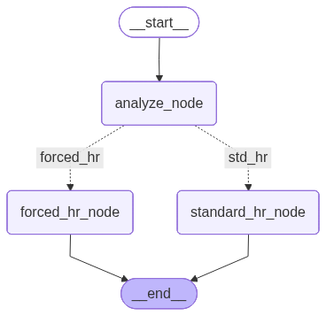
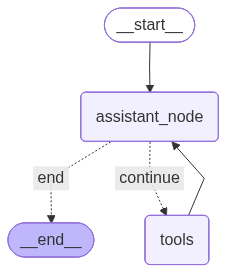

# Langgraph Demo

Un projet de démonstration utilisant `langgraph`, `langchain` et `langchain-openai` pour construire des flux de travail d'agents et des graphes d'état.

## Objectif

Ce projet illustre comment créer un graphe d'état avec `langgraph` pour:

- analyser des dossiers employés et router le traitement vers un service RH standard ou forcé
- construire un agent conversationnel capable d'appeler des outils (`add`, `multiply`, `divide`, `sub`)
- enregistrer l'historique du graphe via un checkpointer en mémoire
- visualiser la structure du graphe avec une représentation Mermaid

## Contenu du projet

- `langgraph.ipynb` : notebook principal de démonstration
- `main.py` : point d'entrée minimal du projet
- `pyproject.toml` : configuration du projet Python et dépendances
- `.env` : configuration de la clé OpenAI (non versionnée ici pour Git)

## Prérequis

- Python 3.13 ou supérieur
- Clé OpenAI valide

## Installation

1. Clonez le dépôt ou placez-vous dans le dossier du projet.
2. Créez un environnement virtuel :

```bash
python -m venv .venv
```

3. Activez l'environnement :

```powershell
.\.venv\Scripts\Activate.ps1
```

4. Installez les dépendances :

```bash
pip install -r requirements.txt
```

> Si `requirements.txt` n'existe pas, utilisez `pip install -e .` ou installez les dépendances listées dans `pyproject.toml`.

## Configuration

Créez un fichier `.env` dans la racine du projet et ajoutez votre clé OpenAI :

```env
OPENAI_API_KEY=sk-...
```

## Utilisation

### Exécuter le notebook

Ouvrez `langgraph.ipynb` avec Jupyter Notebook ou JupyterLab pour explorer les cellules de démonstration.

### Lancer le script Python

```bash
python main.py
```

## Fonctionnalités démontrées

- définition d'un type `TypedDict` pour l'état des employés
- ajout de nœuds et d'arêtes dans `StateGraph`
- routeur conditionnel basé sur le résultat d'une analyse
- intégration d'outils LangChain pour le calcul arithmétique
- exécution d'un agent OpenAI via `ChatOpenAI`
- visualisation du graphe avec `draw_mermaid_png()`

## Images PNG générées

Le projet contient deux fichiers PNG représentant les graphes produits :

- `output_analyse_hr.png` : visualisation du flux RH (`analyze_node`, `standard_hr_node`, `forced_hr_node`)
- `output_assistant.png` : visualisation du flux agent + outils





## Dépendances principales

- `langgraph`
- `langchain`
- `langchain-community`
- `langchain-openai`
- `python-dotenv`
- `ipykernel`

## Notes

- Le notebook contient des exemples d'appel du graphe avec différents profils d'employés.
- Le projet est prévu pour un usage éducatif et expérimental.


